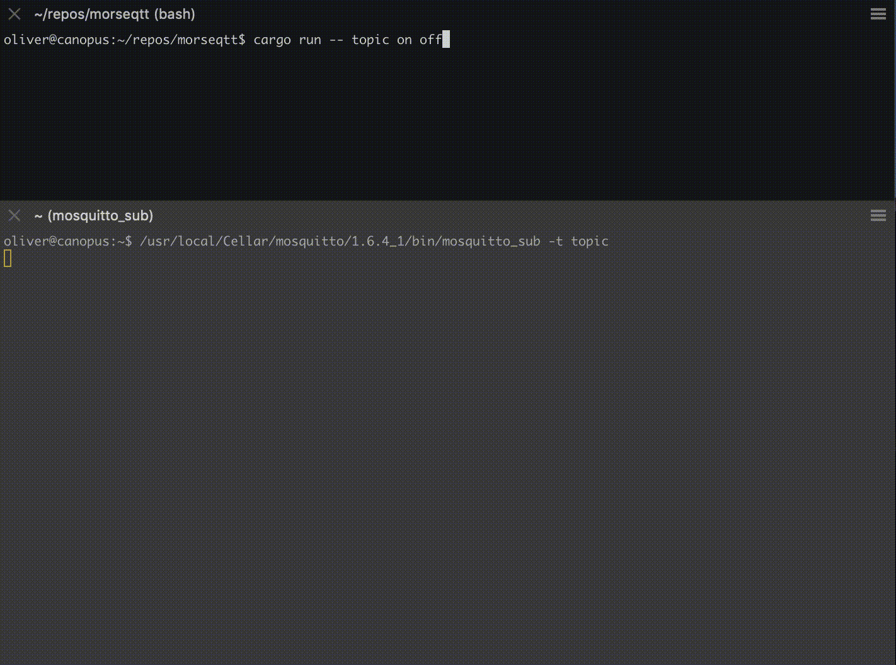

# morseqtt
Encode text to Morse code and transmit with
[MQTT](https://en.wikipedia.org/wiki/MQTT).

Requires rust (I use nightly) and only works on unixies (as this project depends
on `tokio-file-unix`).

## usage
If you need to set up a local MQTT broker for testing, take a look at
[Mosquitto](https://mosquitto.org/).

Start a broker
```
/usr/local/Cellar/mosquitto/1.6.4_1/sbin/mosquitto -c /usr/local/etc/mosquitto/mosquitto.conf
```

Start a subscriber
```
/usr/local/Cellar/mosquitto/1.6.4_1/bin/mosquitto_sub -t topic
```

Then start sending some messages!




Currently, `morseqtt` requires the broker to allow anonymous connections.

By default, `morseqtt` connects to `localhost:1883`. Pass `--help` for a
description of options.
